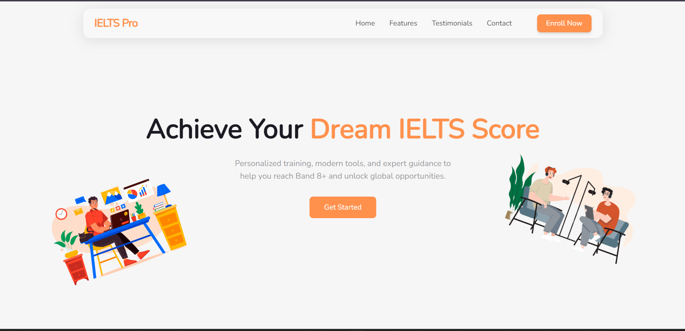

# IELTS Pro – Landing Page

This project is an assignment for internship from babycode IELTS preperation platform.

---
### Design Choices

- Color System: Coral (primary), Neutral (background & text), Minty Accent (secondary highlights), These were defined in index.css for global use with all the variations.

- Fonts: Nunito,  Open Sans for readability and modern aesthetics.

- Layout:

    - Glass-blur floating Navbar

    - Hero section with strong CTA

    - Feature cards with images + text

    - estimonials (optional extension)

    - Footer with contact info + quick links

## Setup & Installation

Clone the repo

```
git clone https://github.com/your-username/ielts-pro-landing.git
cd ielts-pro-landing
```
Install dependencies
```
npm install
```
Run the development server

```
npm run dev
```


Build for production
```
npm run build
```
---


###  Preview - Hero Section



